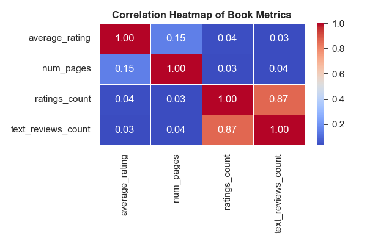
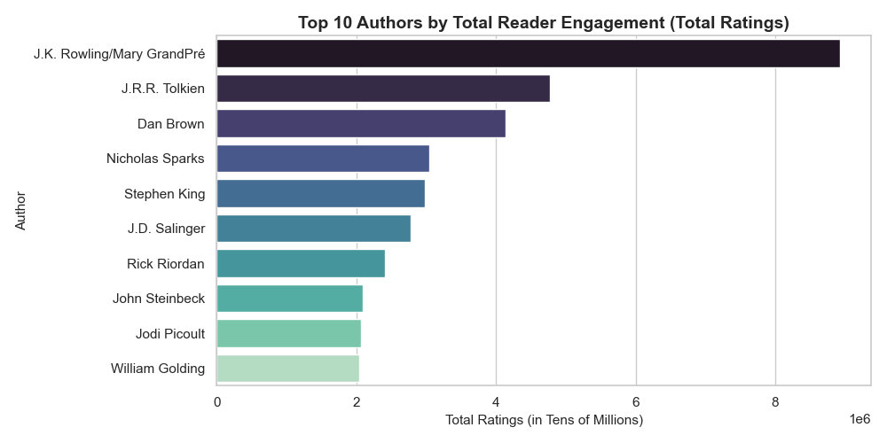
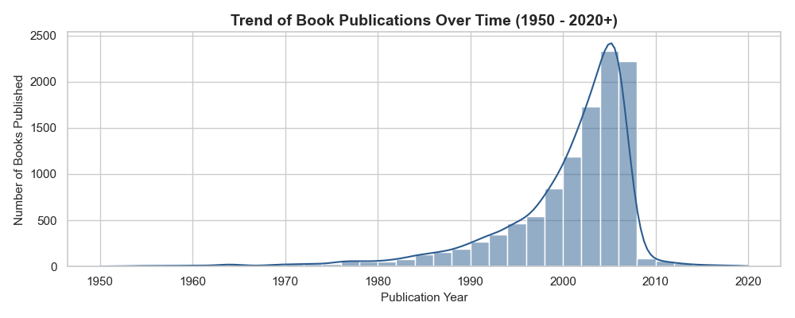

# 📚 Goodreads Literary Landscape: A Comprehensive Market Analysis

An end-to-end Exploratory Data Analysis (EDA) and Business Intelligence project evaluating a dataset of 11,000+ books from Goodreads. This project uncovers critical market indicators, publisher distribution dynamics, reader behavioral correlations, and historical publication trends using Python.

---

## 📌 Project Overview
The primary objective of this project is to dissect the Goodreads dataset to understand how structural attributes (such as page count, author popularity, and publishing houses) influence a book's overall market performance, reader footprint, and user sentiment. By implementing industry-standard data cleaning, statistical modeling, and advanced feature visualization, this project transforms raw text/numerical data into actionable business intelligence for the digital publishing landscape.

---

## 🛠️ Tech Stack & Dependencies
The entire analysis pipeline, from data ingestion to asset visualization, is built using the following core technologies:
* **Programming Language:** Python 3.x
* **Data Engineering & Manipulation:** `pandas`, `numpy`
* **Statistical Data Visualization:** `matplotlib`, `seaborn`

---

## 📊 Key Analytical Insights & Dashboards

### 1. Metric Correlations & Feature Interactions
A statistical Correlation Matrix was engineered to determine linear relationships between key numerical attributes. 
* **High-Density Engagement Linkage (r = 0.87):** A powerful, positive correlation exists between `ratings_count` and `text_reviews_count`. This indicates that a high volume of scoring consumers strongly predicts a proportional increase in descriptive, textual feedback.
* **Structural Independence (r = 0.15):** The physical length of a book (`num_pages`) demonstrates a negligible correlation with its `average_rating`. This mathematically proves that book volume does not fundamentally sway overall reader satisfaction.

<h4 align="center">Feature Correlation Matrix Heatmap</h4>
<p align="center">
  
</p>
<p align="center">
  <em>Figure 1: Seaborn Heatmap evaluating absolute mathematical correlations across data variables.</em>
</p>

---

### 2. Reader Footprint & Author Impact Analysis
To evaluate true asset value, authors were isolated and ranked by aggregate customer interactions rather than purely by production volume:
* **High-Value Intellectual Properties:** **J.K. Rowling** and **J.R.R. Tolkien** command an extraordinary per-book reader engagement rate. Despite having only 6 core cataloged titles in this dataset segment, J.K. Rowling captures over **8.9 Million total user ratings** with an elite average score of 4.55/5.
* **Volume Distribution Leaders:** **Stephen King** and **P.G. Wodehouse** lead the data catalog in sheer scale of publication density, contributing 40 distinct cataloged volumes each.

<h4 align="center">Top 10 Authors by Aggregate Reader Engagement</h4>
<p align="center">
  
</p>
<p align="center">
  <em>Figure 2: Data visualization breakdown profiling author dominance based on global rating counts.</em>
</p>

---

### 3. Historical Publication Trends
By isolating the calendar year from the raw `publication_date` field, a time-series distribution analysis was executed. The data captures a significant industry acceleration and cataloging boom between **2000 and 2006**, marking the foundational rise of online reader ecosystems and early web-based community metadata integration.

<h4 align="center">Global Book Cataloging Distribution Over Time (1950 - Present)</h4>
<p align="center">
  
</p>
<p align="center">
  <em>Figure 3: Historical time-series trend visualizing the chronological velocity of book publications.</em>
</p>

---

## ⚙️ Local Development & Replication Setup

Follow these structured steps to replicate this environment and run the data pipeline locally on your machine:


1. **Clone the repository to your local machine:**
   ```bash
   git clone git clone [https://github.com/Pranav0920/Goodreads-Books-Data-Analysis.git](https://github.com/Pranav0920/Goodreads-Books-Data-Analysis.git)

2. Install the required libraries:
     Make sure you have Python installed, then install the necessary dependencies using pip:

   pip install pandas seaborn matplotlib

3. Run the python script:
     Navigate into the project folder and execute the main analysis script:

   python analysis.py
